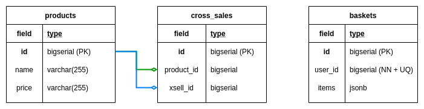

# eCommerce Cross-selling with Hexagonal Architecture

## Goal

Implement ecommerce with Maven modules for each layer of the Hexagonal Architecture and without waiting for the necessary services to be available.

## Given

#### 1. We have an eCommerce Rest API with the following endpoints:

- GET /api/products

- GET /api/products/{productId}

- GET /api/users/{userId}/basket

- POST /api/users/{userId}/basket

#### 2. When we enter the products page, the list of all products is returned to us:

- GET /api/products
```json
[
  {
    "id": 1,
    "name": "Dell Latitude 3301 Intel Core i7-8565U/8GB/512GB SSD/13.3",
    "price": "999,00 €"
  },
  {
    "id": 2,
    "name": "Samsonite Airglow Laptop Sleeve 13.3",
    "price": "41,34 €"
  },
  {
    "id": 3,
    "name": "Logitech Wireless Mouse M185",
    "price": "10,78 €"
  },
  {
    "id": 4,
    "name": "Fellowes Mouse Pad Black",
    "price": "1,34 €"
  }
]
```

#### 3. When we obtain a product by its ID, the related products are returned next to it:

- GET /api/products/{productId}
```json
{
  "product": {
    "id": 1,
    "name": "Dell Latitude 3301 Intel Core i7-8565U/8GB/512GB SSD/13.3",
    "price": "999,00 €"
  },
  "cross_selling": [
    {
      "id": 2,
      "name": "Samsonite Airglow Laptop Sleeve 13.3",
      "price": "41,34 €"
    },
    {
      "id": 3,
      "name": "Logitech Wireless Mouse M185",
      "price": "10,78 €"
    }
  ]
}
```

#### 4. We can get a user's basket by their **ID**.

- GET /api/users/{userId}/basket
```json
{
  "id": 1,
  "userId": 1,
  "items": {
    "products": [
      {
        "id": 3,
        "name": "Logitech Wireless Mouse M185",
        "price": "10,78 €"
      }
    ]
  }
}
```

#### 5. If the customer does not have a basket with products, is returned `HttpStatus.NOT_FOUND`.

#### 6. We can add products to this basket with POST and the payload:

- POST /api/users/{userId}/basket
```json
{
  "id": 3,
  "name": "Logitech Wireless Mouse M185",
  "price": "10,78 €"
}
```

#### 8. When we add a product to a basket and the basket does not exist, it is created automatically and the product is added successfully.

#### 9. When we add a product, it already exists in the basket, it is not added.

#### 10. Use PostgreSQL to save the data.


#### 11. Use native queries to manage cross-sell data.

#### 12. This is the example of the [table creations](./docs/CREATE_TABLES.sql).